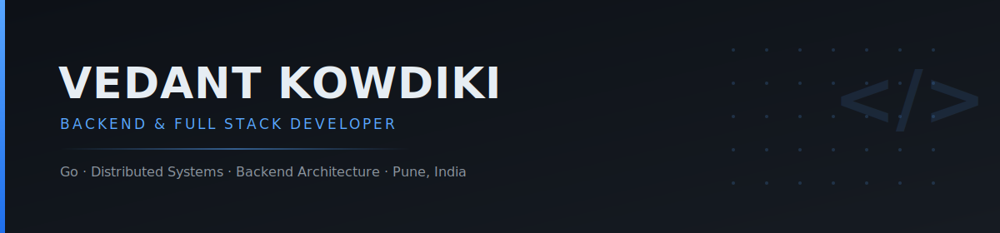

<div align="center">




<a href="https://github.com/Vex-15"></a>
<a href="https://linkedin.com/in/YOUR_LINKEDIN"></a>
<a href="https://medium.com/@vexstack"></a>
<a href="https://twitter.com/YOUR_TWITTER"></a>


</div>


<!--  -->

## About Me

```yaml
name: Vedant Kowdiki
role: Backend & Full Stack Developer
location: Pune, India
education: B.Tech CSE (Data Science)
graduation: 2028
languages: [Go, Python, Java, C++, TypeScript]
interests: [Backend Engineering, Distributed Systems, System Design]
```

> If a design can't survive production traffic, it isn't finished yet.

<br/>

<!-- <table>
<tr>
<td width="33%" valign="top">

**Focus**

Backend engineering, distributed systems, and concurrency-first Go design.

</td>
<td width="33%" valign="top">

**Currently Building**

Go backend projects that model real production constraints, not tutorials.

</td>
<td width="33%" valign="top">

**Open To**

Backend/SWE internships (2027) and collaboration on Go-based systems.

</td>
</tr>
</table> -->
<!--  -->


## Tech Stack

<table>
<tr>
<td width="50%" valign="top">

**Languages**


</td>
<td width="50%" valign="top">

**Frontend**


</td>
</tr>
<tr>
<td valign="top">

**Database**


</td>
<td valign="top">

**Tools**


</td>
</tr>
<tr>
<td colspan="2" valign="top">

**Backend**


</td>
</tr>
</table>


## Latest Blog Posts

<table>
<tr>
<td width="100%">

### Building a Concurrent File Downloader in Go

Notes from building **FileX** — worker pools, progress tracking, and the concurrency trade-offs along the way.

**[Read on Medium →](https://medium.com/@vexstack)**

</td>
</tr>
</table>

<!-- BLOG-POST-LIST:START -->
- [Building a Concurrent File Downloader in Go: A Practical Guide to Goroutines](https://medium.com/@vexstack/building-a-concurrent-file-downloader-in-go-a-practical-guide-to-goroutines-4071dd01f946?source=rss-16c3c76a7f97------2)
<!-- BLOG-POST-LIST:END -->


## GitHub Statistics

<div align="center">


</div>


<div align="center">

Thanks for taking the time to look through this profile.

**Always Building • Always Learning • Always Improving**

<br/>


</div>
